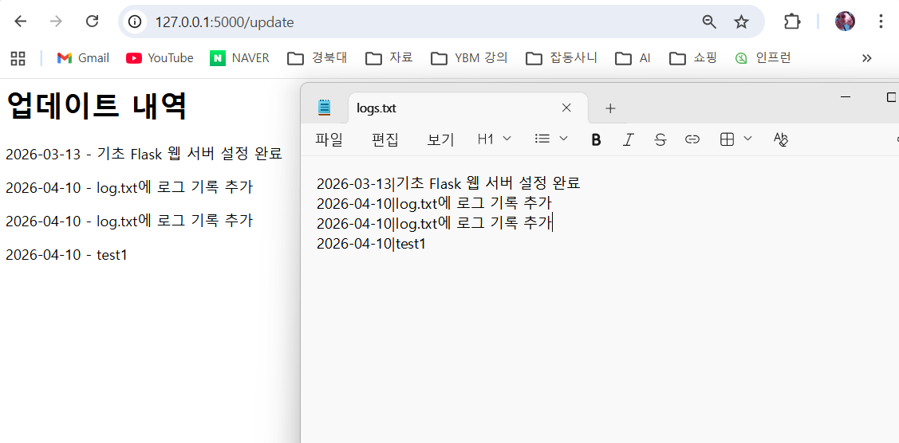

# 📖 My Development Journal API
> "코드가 곧 문서다(Single Source of Truth). 개발자 경험(DX)을 최우선으로 고려한 개발 일지 관리 API."

## 🎥 Visual Demonstration


## 🎯 Motivation & Problem
초기에는 개발 진행 상황을 단순한 텍스트 파일이나 주석에 기록했지만, 파편화된 기록은 추적이 어려웠습니다. 이를 해결하기 위해 직접 개발 일지 API를 구축했습니다. 더불어 이번 프로젝트의 핵심 목표는 단순히 돌아가는 코드를 만드는 것을 넘어, **'읽기 쉬운 코드'와 '명확한 API'를 설계하는 것**이었습니다. 코드를 단일 진실의 원천으로 삼아, 코드 변경 시 문서도 자동으로 동기화되도록 구현했습니다.

## 🛠 Tech Stack & Rationale
* **Python & Flask:** 가볍고 유연하여 마이크로서비스 및 API 서버를 빠르게 구축하고 구조를 학습하는 데 최적화되어 있어 선택했습니다.
* **Sphinx (with autodoc, napoleon):** 코드 내 Google 스타일 독스트링을 기반으로 교차 링크가 지원되는 깔끔한 기술 문서를 자동 생성하기 위해 도입했습니다.
* **Flasgger (OpenAPI 2.0/3.0):** 별도의 외부 문서 툴 없이, 독스트링 내에 작성된 명세를 통해 인터랙티브한 Swagger UI를 즉시 제공하여 개발자 경험(DX)을 높이기 위해 사용했습니다.

## ✨ Key Features
* **개발 로그 추가/조회 API:** 날짜와 내용을 기반으로 개발 로그를 저장하고 열람할 수 있습니다.
* **객체 지향적 설계:** 데이터 모델(`UpdateLog`)과 레포지토리 패턴(`LogRepository`)을 분리하여 데이터 관리의 책임을 명확히 했습니다.
* **인터랙티브 API 브라우저 (Swagger UI):** `/apidocs/` 경로에서 누구나 쉽게 API 명세를 확인하고 직접 테스트해 볼 수 있습니다.
* **자동화된 코드 명세서:** Sphinx를 활용해 클래스와 함수들의 매개변수, 반환값, 예외 처리 등을 정리한 HTML 정적 웹사이트를 제공합니다.

## 🚀 Getting Started
아래 명령어를 통해 로컬 환경에서 프로젝트를 바로 실행해 볼 수 있습니다.

```bash
# 1. 저장소 클론
git clone [https://github.com/](https://github.com/)[V-Jin]/flask-blog.git
cd flask-blog

# 2. 가상 환경 생성 및 활성화 (권장, 선택 사항)
python -m venv venv
# Windows: venv\Scripts\activate
# Mac/Linux: source venv/bin/activate

# 3. 의존성 패키지 설치 (미리 requirements.txt를 생성해두었다고 가정)
pip install -r requirements.txt
# 또는 pip install flask flasgger sphinx sphinx_rtd_theme

# 4. 서버 실행
python run.py